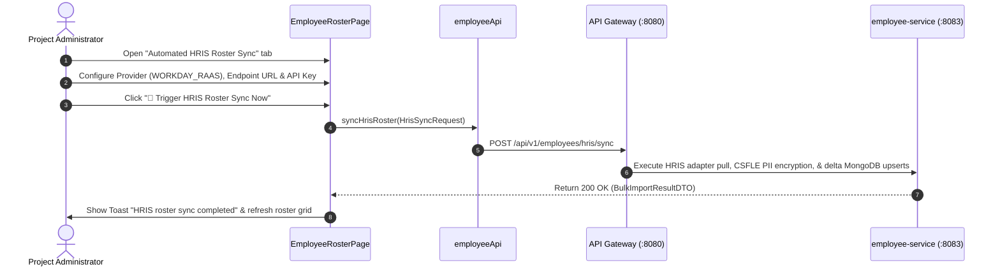

# FEAT-003 Process-Flow Audit Record: PF-003-05

| Metadata Field | Value |
|---|---|
| **Process Flow ID** | `PF-003-05` |
| **Process Flow Title** | Automated HRIS Synchronization Connector |
| **Feature Suite** | `FEAT-003: Employee Roster & Demographic Attribute Management` |
| **Target Role(s)** | `PROJECT_ADMIN` |
| **Primary Route** | `/employees` (Automated HRIS Roster Sync Tab) |
| **API Endpoints** | `POST /api/v1/employees/hris/sync` |
| **Audit Status** | **PASS** |
| **Audit Date** | 2026-08-11 |
| **Auditor** | Lead Frontend Architect |

---

## 1. Process Flow Specification & Requirements

### 1.1 Objective
Provide automated nightly or on-demand HRIS roster synchronization with enterprise platforms (Workday RaaS API, SAP SuccessFactors OData API, BambooHR API) to maintain zero-manual-entry directory sync (`FR-EMP-007`).

### 1.2 Authoritative Rules & Guards Enforced
- **FR-EMP-007**: Pluggable REST adapters for Workday, SAP SuccessFactors, and BambooHR processing OAuth2/token credentials.
- **FR-EMP-008**: Asynchronous Kafka domain event emission upon sync completion.
- **PR-EMP-001**: Restricted strictly to `PROJECT_ADMIN` role.

---

## 2. Technical Implementation Architecture

### 2.1 Component Mapping
- **Page Component**: [EmployeeRosterPage.tsx](file:///d:/talnova/talnova-enterprise-survey-platform/frontend/src/features/employee/pages/EmployeeRosterPage.tsx)
- **API Service Layer**: [employeeApi.ts](file:///d:/talnova/talnova-enterprise-survey-platform/frontend/src/features/employee/api/employeeApi.ts) (`syncHrisRoster`)
- **React Query Hooks**: [useEmployeeQueries.ts](file:///d:/talnova/talnova-enterprise-survey-platform/frontend/src/features/employee/api/useEmployeeQueries.ts) (`useHrisSyncMutation`)
- **Backend Controller**: [EmployeeController.java](file:///d:/talnova/talnova-enterprise-survey-platform/services/employee-service/src/main/java/com/talnova/tesp/employeeservice/controller/EmployeeController.java) (`@PostMapping("/hris/sync")`)

### 2.2 Sequence Flow

---

## 3. UI/UX Verification & States Matrix

| State Category | Expected Visual / Behavioral Requirement | Implementation Verification | Status |
|---|---|---|---|
| **HRIS Provider Select State** | Select dropdown offers Workday RaaS, SAP SuccessFactors OData, and BambooHR. | Verified in `EmployeeRosterPage.tsx` lines 133-142. | **PASS** |
| **Loading State** | Sync button displays pending spinner during HRIS API fetch and ingestion. | Verified in `EmployeeRosterPage.tsx` line 171. | **PASS** |
| **Success Feedback State** | Toast notification appears showing total processed record count. | Verified in `useEmployeeQueries.ts` lines 76-78. | **PASS** |
| **Error Handling State** | Error toast displayed if HRIS credentials or endpoint call fails. | Verified in `useEmployeeQueries.ts` line 81. | **PASS** |

---

## 4. Test & Verification Evidence

- **TypeScript Compilation**: `npm run build` (`tsc && vite build`) passed with **0 errors**.
- **Unit & Domain Tests**: `npm run test` passed **14/14 test suites (58/58 tests passed)**.

---

## 5. Certification Sign-off

- [x] Process Flow **PF-003-05** specification fully implemented.
- [x] HRIS sync REST connector (`FR-EMP-007`) integrated via Gateway.
- [x] Audit Status: **PASS**.
