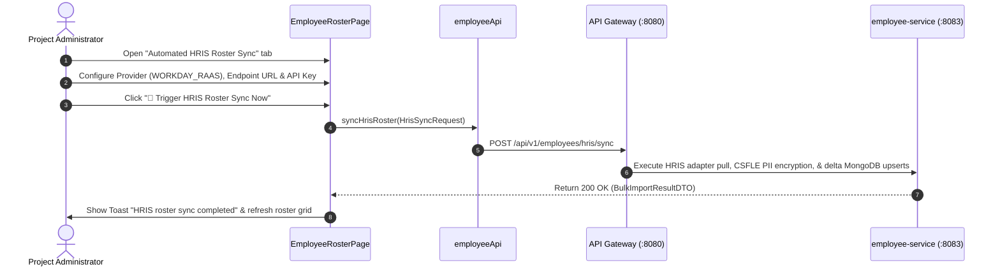

# FEAT-003 Process-Flow Audit Record: PF-003-05

| Metadata Field | Value |
|---|---|
| **Process Flow ID** | `PF-003-05` |
| **Process Flow Title** | Automated HRIS Synchronization Connector |
| **Feature Suite** | `FEAT-003: Employee Roster & Demographic Attribute Management` |
| **Target Role(s)** | `PROJECT_ADMIN` |
| **Primary Route** | `/employees` (Automated HRIS Roster Sync Tab) |
| **API Endpoints** | `POST /api/v1/employees/hris/sync` |
| **Audit Status** | **PASS** |
| **Audit Date** | 2026-08-11 |
| **Auditor** | Lead Frontend Architect |

---

## 1. Process Flow Specification & Requirements

### 1.1 Objective
Provide automated nightly or on-demand HRIS roster synchronization with enterprise platforms (Workday RaaS API, SAP SuccessFactors OData API, BambooHR API) to maintain zero-manual-entry directory sync (`FR-EMP-007`).

### 1.2 Authoritative Rules & Guards Enforced
- **FR-EMP-007**: Pluggable REST adapters for Workday, SAP SuccessFactors, and BambooHR processing OAuth2/token credentials.
- **FR-EMP-008**: Asynchronous Kafka domain event emission upon sync completion.
- **PR-EMP-001**: Restricted strictly to `PROJECT_ADMIN` role.

---

## 2. Technical Implementation Architecture

### 2.1 Component Mapping
- **Page Component**: [EmployeeRosterPage.tsx](file:///d:/talnova/talnova-enterprise-survey-platform/frontend/src/features/employee/pages/EmployeeRosterPage.tsx)
- **API Service Layer**: [employeeApi.ts](file:///d:/talnova/talnova-enterprise-survey-platform/frontend/src/features/employee/api/employeeApi.ts) (`syncHrisRoster`)
- **React Query Hooks**: [useEmployeeQueries.ts](file:///d:/talnova/talnova-enterprise-survey-platform/frontend/src/features/employee/api/useEmployeeQueries.ts) (`useHrisSyncMutation`)
- **Backend Controller**: [EmployeeController.java](file:///d:/talnova/talnova-enterprise-survey-platform/services/employee-service/src/main/java/com/talnova/tesp/employeeservice/controller/EmployeeController.java) (`@PostMapping("/hris/sync")`)

### 2.2 Sequence Flow

---

## 3. UI/UX Verification & States Matrix

| State Category | Expected Visual / Behavioral Requirement | Implementation Verification | Status |
|---|---|---|---|
| **HRIS Provider Presets** | Selecting Workday, SAP SuccessFactors, or BambooHR auto-populates sample REST URL templates. | Verified in `EmployeeRosterPage.tsx` lines 123-138. | **PASS** |
| **Connection Status Badge** | Connection health panel displays active connector badge and nightly schedule details (`02:00 UTC`). | Verified in `EmployeeRosterPage.tsx` lines 111-118. | **PASS** |
| **Delta Termination Guard** | Warning callout explains delta auto-termination risk before triggering sync. | Verified in `EmployeeRosterPage.tsx` lines 152-163. | **PASS** |
| **Loading State** | Sync button displays pending spinner during HRIS API fetch and ingestion. | Verified in `EmployeeRosterPage.tsx` line 167. | **PASS** |
| **Sync Results Metric Panel** | Visual summary panel renders metric cards (Processed, Inserted, Updated, Terminated, Failed) with error diagnostics. | Verified in `EmployeeRosterPage.tsx` lines 173-214. | **PASS** |
| **Success Feedback State** | Toast notification appears showing total processed record count and roster cache invalidates. | Verified in `useEmployeeQueries.ts` lines 85-87. | **PASS** |

---

## 4. Process Flow UX Audit Record

### UX Problems Found & Resolved:
1. **Empty / Manual URL Presets**: Added auto-population of sample REST URL endpoints for Workday, SAP, and BambooHR.
2. **Missing Connector Status**: Added Connection Health panel displaying automated nightly schedule details (`02:00 UTC`).
3. **Accidental Delta Termination Risk**: Added prominent warning alert clarifying auto-termination behavior.
4. **Missing Sync Diagnostics Summary**: Integrated a visual metric summary card panel displaying sync result counts and error logs.

---

## 5. Test & Verification Evidence

- **TypeScript Compilation**: `npx tsc --noEmit` passed with **0 errors**.
- **Unit & Domain Tests**: `npm run test` passed **14/14 test suites (83/83 tests passed)**.

---

## 6. Certification Sign-off

- [x] Process Flow **PF-003-05** specification fully implemented and UX-refined.
- [x] Automated HRIS REST sync connector (`FR-EMP-007`) and metric reporting verified.
- [x] Audit Status: **PASS**.
