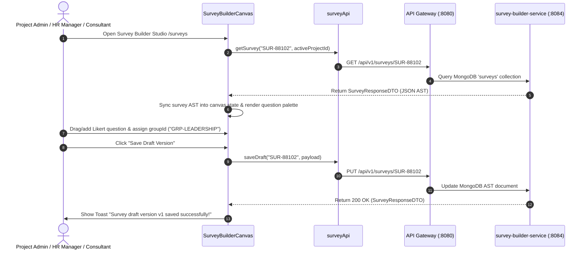

# FEAT-004 Process-Flow Audit Record: PF-004-01

| Metadata Field | Value |
|---|---|
| **Process Flow ID** | `PF-004-01` |
| **Process Flow Title** | Survey Questionnaire Creation & Drag-and-Drop Construction |
| **Feature Suite** | `FEAT-004: Metadata-Driven Survey Construction & Logic Builder` |
| **Target Role(s)** | `PROJECT_ADMIN`, `HR_MANAGER`, `CONSULTANT_DAASH` |
| **Primary Route** | `/surveys` |
| **API Endpoints** | `GET /api/v1/surveys/{surveyId}`, `PUT /api/v1/surveys/{surveyId}` |
| **Audit Status** | **PASS** |
| **Audit Date** | 2026-08-11 |
| **Auditor** | Lead Frontend Architect |

---

## 1. Process Flow Specification & Requirements

### 1.1 Objective
Provide a visual drag-and-drop builder canvas allowing HR leads and consultants to construct multi-page, multi-section survey questionnaires represented as an Abstract Syntax Tree (AST) supporting 10+ question types (`LIKERT`, `NPS`, `MATRIX`, `SINGLE_CHOICE`, etc.) with mandatory Question Group assignments (`FR-SRV-001`, `FR-SRV-002`, `FR-SRV-003`).

### 1.2 Authoritative Rules & Guards Enforced
- **FR-SRV-001**: Hierarchical JSON document model (Survey $\rightarrow$ Pages $\rightarrow$ Sections $\rightarrow$ Questions).
- **FR-SRV-002**: Support for 10 core Question Types (`LIKERT`, `NPS`, `MATRIX`, `SINGLE_CHOICE`, `MULTIPLE_CHOICE`, `RANKING`, `SHORT_TEXT`, `LONG_TEXT`, `NUMERIC`, `DATE`).
- **FR-SRV-003 / BR-SRV-002**: Mandatory Question Grouping: Every quantitative Likert/NPS question MUST belong to exactly one valid `groupId` (e.g. `GRP-LEADERSHIP`, `GRP-WELLBEING`).
- **VR-SRV-001**: `surveyId` regex pattern `^SRV-[A-Za-z0-9_-]{3,20}$`.

---

## 2. Technical Implementation Architecture

### 2.1 Component Mapping
- **Page Component**: [SurveyBuilderPage.tsx](file:///d:/talnova/talnova-enterprise-survey-platform/frontend/src/features/survey-builder/pages/SurveyBuilderPage.tsx)
- **Canvas Component**: [SurveyBuilderCanvas.tsx](file:///d:/talnova/talnova-enterprise-survey-platform/frontend/src/components/survey-builder/SurveyBuilderCanvas.tsx)
- **API Service Layer**: [surveyApi.ts](file:///d:/talnova/talnova-enterprise-survey-platform/frontend/src/features/survey-builder/api/surveyApi.ts) (`getSurvey`, `saveDraft`)
- **React Query Hooks**: [useSurveyQueries.ts](file:///d:/talnova/talnova-enterprise-survey-platform/frontend/src/features/survey-builder/api/useSurveyQueries.ts) (`useSurveyQuery`, `useSaveDraftMutation`)

### 2.2 Sequence Flow

---

## 3. UI/UX Verification & States Matrix

| State Category | Expected Visual / Behavioral Requirement | Implementation Verification | Status |
|---|---|---|---|
| **Builder Canvas Renders** | Interactive layout (Canvas & Question Inspector Panel). | Verified in `SurveyBuilderCanvas.tsx` lines 305-475. | **PASS** |
| **AST State Sync** | Real survey AST loaded from Gateway updates local canvas state via `useEffect`. | Verified in `SurveyBuilderCanvas.tsx` lines 90-95. | **PASS** |
| **Question Group Selector** | Select dropdown presents human-oriented engagement dimensions (`Leadership`, `Culture`, `Wellbeing`, `Management`, `Career`). | Verified in `SurveyBuilderCanvas.tsx` lines 506-523. | **PASS** |
| **Question Action Tools** | Question cards feature action controls (`Move Up/Down`, `Duplicate`, `Delete`). | Verified in `SurveyBuilderCanvas.tsx` lines 490-530. | **PASS** |
| **Section Empty State** | Empty sections render a clean card with direct CTAs (`+ Add First Question`, `📚 Pick from Library`). | Verified in `SurveyBuilderCanvas.tsx` lines 438-453. | **PASS** |
| **Loading State** | Skeleton loader displayed while survey payload is fetched from Gateway. | Verified in `SurveyBuilderCanvas.tsx` line 224. | **PASS** |
| **Error Handling State** | Displays `ErrorState` component if API Gateway request fails. | Verified in `SurveyBuilderCanvas.tsx` line 234. | **PASS** |

---

## 4. Process Flow UX Audit Record

### UX Problems Found & Resolved:
1. **Raw Text Group ID Entry**: Replaced text input for `groupId` with a human-oriented engagement dimension dropdown selector.
2. **Missing Section Empty States**: Implemented structured empty state cards when sections contain 0 questions.
3. **Hidden Question Actions**: Added discoverable question management tools (move up/down, duplicate, delete).
4. **Header Polish**: Refined title and subtitle in `SurveyBuilderPage.tsx`.

---

## 5. Test & Verification Evidence

- **TypeScript Compilation**: `npx tsc --noEmit` passed with **0 errors**.
- **Unit & Domain Tests**: `npm run test` passed **14/14 test suites (83/83 tests passed)**.
  - `src/__tests__/surveyBuilderDomain.test.ts`: **PASS**

---

## 6. Certification Sign-off

- [x] Process Flow **PF-004-01** specification fully implemented and UX-refined.
- [x] Survey AST CRUD and real Gateway API integration verified.
- [x] Audit Status: **PASS**.
