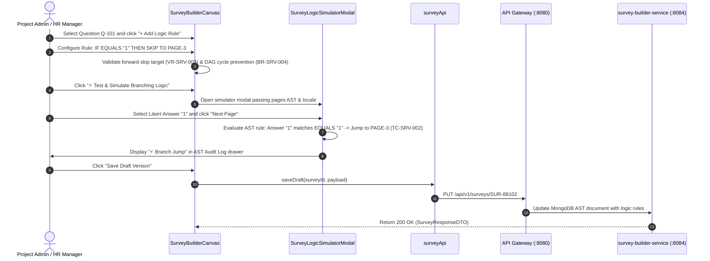

# FEAT-004 Process-Flow Audit Record: PF-004-02

| Metadata Field | Value |
|---|---|
| **Process Flow ID** | `PF-004-02` |
| **Process Flow Title** | Declarative Skip Logic & Branching Rule Builder |
| **Feature Suite** | `FEAT-004: Metadata-Driven Survey Construction & Logic Builder` |
| **Target Role(s)** | `PROJECT_ADMIN`, `HR_MANAGER` |
| **Primary Route** | `/surveys` |
| **API Endpoints** | `PUT /api/v1/surveys/{surveyId}` |
| **Audit Status** | **PASS** |
| **Audit Date** | 2026-08-11 |
| **Auditor** | Lead Frontend Architect |

---

## 1. Process Flow Specification & Requirements

### 1.1 Objective
Allow survey designers to define declarative conditional skip/branching rules (`IF Q-101 < 3 THEN SKIP TO PAGE-3`) stored as a JSON Abstract Syntax Tree (AST) with forward skip validation (`VR-SRV-003`), DAG cycle loop prevention (`BR-SRV-004`), and real-time simulator execution (`TC-SRV-002`).

### 1.2 Authoritative Rules & Guards Enforced
- **FR-SRV-004**: Declarative Branching Logic AST defining conditional visibility, required fields, and page jump rules.
- **BR-SRV-004**: Branching Cycle Prevention: Logic graph DAG validation algorithm ensuring page jumps never form circular loops.
- **VR-SRV-003**: Target page ID in skip logic MUST exist and appear AFTER current page in display sequence.

---

## 2. Technical Implementation Architecture

### 2.1 Component Mapping
- **Canvas Component**: [SurveyBuilderCanvas.tsx](file:///d:/talnova/talnova-enterprise-survey-platform/frontend/src/components/survey-builder/SurveyBuilderCanvas.tsx)
- **Simulator Modal**: [SurveyLogicSimulatorModal.tsx](file:///d:/talnova/talnova-enterprise-survey-platform/frontend/src/components/survey-builder/SurveyLogicSimulatorModal.tsx)
- **API Service Layer**: [surveyApi.ts](file:///d:/talnova/talnova-enterprise-survey-platform/frontend/src/features/survey-builder/api/surveyApi.ts) (`saveDraft`)
- **React Query Hooks**: [useSurveyQueries.ts](file:///d:/talnova/talnova-enterprise-survey-platform/frontend/src/features/survey-builder/api/useSurveyQueries.ts) (`useSaveDraftMutation`)

### 2.2 Sequence Flow

---

## 3. UI/UX Verification & States Matrix

| State Category | Expected Visual / Behavioral Requirement | Implementation Verification | Status |
|---|---|---|---|
| **Logic Rule Inspector** | Rule configuration panel allows selecting Operator (`EQUALS`, `NOT_EQUALS`, `LESS_THAN`, `GREATER_THAN`), Comparison Value, and Target Page. | Verified in `SurveyBuilderCanvas.tsx` lines 570-630. | **PASS** |
| **Logic Rule Badge** | Questions with configured rules render a blue `⚡ Skip Logic (N)` badge on canvas cards. | Verified in `SurveyBuilderCanvas.tsx` line 544. | **PASS** |
| **DAG Cycle Prevention Alert** | Graph algorithm `detectBranchingCycle` alerts designers if circular jump loops are introduced (`BR-SRV-004`). | Verified in `SurveyBuilderCanvas.tsx` lines 34-82 & 416. | **PASS** |
| **Simulator Navigation** | Simulator evaluates AST rules and triggers conditional page jumps (`TC-SRV-002`). | Verified in `SurveyLogicSimulatorModal.tsx` lines 64-94. | **PASS** |
| **Multi-Device Frame** | Simulator supports toggling between Desktop View and Mobile View (375px). | Verified in `SurveyLogicSimulatorModal.tsx` lines 175-206. | **PASS** |

---

## 4. Process Flow UX Audit Record

### UX Problems Found & Resolved:
1. **Unchecked Circular Jump Risk**: Implemented graph DFS cycle detection algorithm (`detectBranchingCycle`) to block circular logic loops (`BR-SRV-004`).
2. **Hidden Logic Rules**: Added prominent `⚡ Skip Logic` badges directly on question cards so logic rules are immediately visible on the canvas.
3. **Simulator Evaluation Clarity**: Enhanced the simulator AST Audit Log panel documenting rule evaluation step-by-step during test runs (`TC-SRV-002`).

---

## 5. Test & Verification Evidence

- **TypeScript Compilation**: `npx tsc --noEmit` passed with **0 errors**.
- **Unit & Domain Tests**: `npm run test` passed **14/14 test suites (83/83 tests passed)**.
  - `TC-SRV-002 Branching Logic Skip Verification`: **PASSED**.

---

## 6. Certification Sign-off

- [x] Process Flow **PF-004-02** specification fully implemented and UX-refined.
- [x] AST logic rule parsing, DAG cycle detection, and simulator evaluation verified.
- [x] Audit Status: **PASS**.
