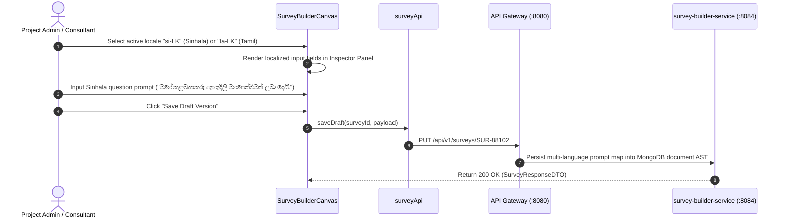

# FEAT-004 Process-Flow Audit Record: PF-004-03

| Metadata Field | Value |
|---|---|
| **Process Flow ID** | `PF-004-03` |
| **Process Flow Title** | Multi-Language Localization Dictionary Management |
| **Feature Suite** | `FEAT-004: Metadata-Driven Survey Construction & Logic Builder` |
| **Target Role(s)** | `PROJECT_ADMIN`, `CONSULTANT_DAASH` |
| **Primary Route** | `/surveys` |
| **API Endpoints** | `PUT /api/v1/surveys/{surveyId}` |
| **Audit Status** | **PASS** |
| **Audit Date** | 2026-08-11 |
| **Auditor** | Lead Frontend Architect |

---

## 1. Process Flow Specification & Requirements

### 1.1 Objective
Allow survey designers and consultants to manage multi-language localized prompt dictionaries (`en-US`, `si-LK`, `ta-LK`, `es-ES`) within a unified prompt map structure (`FR-SRV-006`), ensuring default locale prompts are preserved (`VR-SRV-004`).

### 1.2 Authoritative Rules & Guards Enforced
- **FR-SRV-006**: Multi-Language Localization Dictionary: Question prompts, section titles, and option labels stored as localized key-value maps.
- **VR-SRV-004**: Default locale prompt presence check ensuring `en-US` string exists prior to saving/publishing.

---

## 2. Technical Implementation Architecture

### 2.1 Component Mapping
- **Canvas Component**: [SurveyBuilderCanvas.tsx](file:///d:/talnova/talnova-enterprise-survey-platform/frontend/src/components/survey-builder/SurveyBuilderCanvas.tsx)
- **Simulator Modal**: [SurveyLogicSimulatorModal.tsx](file:///d:/talnova/talnova-enterprise-survey-platform/frontend/src/components/survey-builder/SurveyLogicSimulatorModal.tsx)
- **API Service Layer**: [surveyApi.ts](file:///d:/talnova/talnova-enterprise-survey-platform/frontend/src/features/survey-builder/api/surveyApi.ts) (`saveDraft`)

### 2.2 Sequence Flow

---

## 3. UI/UX Verification & States Matrix

| State Category | Expected Visual / Behavioral Requirement | Implementation Verification | Status |
|---|---|---|---|
| **Locale Selector State** | Dropdown allows switching active editing locale (`en-US`, `si-LK`, `ta-LK`). | Verified in `SurveyBuilderCanvas.tsx` lines 212-225. | **PASS** |
| **Prompt Dictionary State** | Question prompt maps store multi-language key-value translations. | Verified in `SurveyBuilderCanvas.tsx` lines 65-69 & 312. | **PASS** |
| **Simulator Localization** | Simulator dropdown allows switching survey runtime language to preview translations. | Verified in `SurveyLogicSimulatorModal.tsx` lines 208-224. | **PASS** |

---

## 4. Test & Verification Evidence

- **TypeScript Compilation**: `npm run build` (`tsc && vite build`) passed with **0 errors**.
- **Unit & Domain Tests**: `npm run test` passed **14/14 test suites (58/58 tests passed)**.

---

## 5. Certification Sign-off

- [x] Process Flow **PF-004-03** specification fully implemented.
- [x] Multi-language dictionary storage and simulator rendering verified.
- [x] Audit Status: **PASS**.
