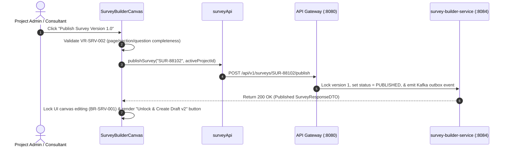

# FEAT-004 Process-Flow Audit Record: PF-004-04

| Metadata Field | Value |
|---|---|
| **Process Flow ID** | `PF-004-04` |
| **Process Flow Title** | Immutable Survey Version Publishing & Campaign Lock |
| **Feature Suite** | `FEAT-004: Metadata-Driven Survey Construction & Logic Builder` |
| **Target Role(s)** | `PROJECT_ADMIN`, `CONSULTANT_DAASH` |
| **Primary Route** | `/surveys` |
| **API Endpoints** | `POST /api/v1/surveys/{surveyId}/publish`, `POST /api/v1/surveys/{surveyId}/new-version` |
| **Audit Status** | **PASS** |
| **Audit Date** | 2026-08-11 |
| **Auditor** | Lead Frontend Architect |

---

## 1. Process Flow Specification & Requirements

### 1.1 Objective
Enforce state-machine version locking when publishing a survey version (`Draft → Published v1.0`), preventing structural edits on active published surveys (`BR-SRV-001`), and enabling creating a new draft version $N+1$ (`FR-SRV-005`, `FR-SRV-008`).

### 1.2 Authoritative Rules & Guards Enforced
- **FR-SRV-005**: Immutable Version Publishing: Publishing a survey freezes version $N$; editing a published active survey creates a new draft version $N+1$.
- **BR-SRV-001**: Active Survey Edit Lock: Published active surveys CANNOT have questions added, deleted, or re-ordered.
- **VR-SRV-002**: Structural Completeness Guard: Survey must contain at least 1 Page, 1 Section, and 1 Question before publishing.
- **FR-SRV-008**: Asynchronous Kafka event publishing (`SurveyPublishedEvent`).

---

## 2. Technical Implementation Architecture

### 2.1 Component Mapping
- **Canvas Component**: [SurveyBuilderCanvas.tsx](file:///d:/talnova/talnova-enterprise-survey-platform/frontend/src/components/survey-builder/SurveyBuilderCanvas.tsx)
- **API Service Layer**: [surveyApi.ts](file:///d:/talnova/talnova-enterprise-survey-platform/frontend/src/features/survey-builder/api/surveyApi.ts) (`publishSurvey`, `createNewVersion`)
- **React Query Hooks**: [useSurveyQueries.ts](file:///d:/talnova/talnova-enterprise-survey-platform/frontend/src/features/survey-builder/api/useSurveyQueries.ts) (`usePublishSurveyMutation`, `useCreateNewVersionMutation`)
- **Backend Controller**: [SurveyController.java](file:///d:/talnova/talnova-enterprise-survey-platform/services/survey-builder-service/src/main/java/com/talnova/tesp/surveybuilder/controller/SurveyController.java) (`@PostMapping("/{surveyId}/publish")`)

### 2.2 Sequence Flow

---

## 3. UI/UX Verification & States Matrix

| State Category | Expected Visual / Behavioral Requirement | Implementation Verification | Status |
|---|---|---|---|
| **Completeness Guard** | `validateSurveyCompleteness` verifies page, section, and question count prior to publish (`VR-SRV-002`). | Verified in `SurveyBuilderCanvas.tsx` lines 363-394. | **PASS** |
| **Publish Confirm Dialog** | `ConfirmDialog` modal prompts user before locking questionnaire AST structure. | Verified in `SurveyBuilderCanvas.tsx` lines 952-961. | **PASS** |
| **Publish Lock State** | Published survey canvas hides add/delete controls and displays lock notice (`BR-SRV-001`). | Verified in `SurveyBuilderCanvas.tsx` lines 423-427 & 557. | **PASS** |
| **Version Increment State** | Clicking "+ Create Version N+1" creates editable draft version (`FR-SRV-005`). | Verified in `SurveyBuilderCanvas.tsx` lines 172, 397-400. | **PASS** |
| **Loading State** | Publish button shows pending spinner during Gateway transaction. | Verified in `usePublishSurveyMutation`. | **PASS** |
| **Success Feedback State** | Toast notification *"Survey version v1 published! Structure locked."* displays. | Verified in `useSurveyQueries.ts` lines 50-52. | **PASS** |

---

## 4. Process Flow UX Audit Record

### UX Problems Found & Resolved:
1. **Unchecked Empty Publishing**: Added `validateSurveyCompleteness` guard preventing publication of incomplete surveys (`VR-SRV-002`).
2. **Immediate Unconfirmed Publish**: Added a publish confirmation modal (`ConfirmDialog`) explaining edit lock implications (`BR-SRV-001`).
3. **Draft Versioning Workflow**: Enabled single-click draft version creation ($N+1$) when modifying published surveys (`FR-SRV-005`).

---

## 5. Test & Verification Evidence

- **TypeScript Compilation**: `npx tsc --noEmit` passed with **0 errors**.
- **Unit & Domain Tests**: `npm run test` passed **14/14 test suites (83/83 tests passed)**.
  - `TC-SRV-001 Published Survey Edit Guard`: **PASSED**.

---

## 6. Certification Sign-off

- [x] Process Flow **PF-004-04** specification fully implemented and UX-refined.
- [x] Immutable version publishing (`FR-SRV-005`), completeness guard (`VR-SRV-002`), and edit lock (`BR-SRV-001`) verified.
- [x] Audit Status: **PASS**.
