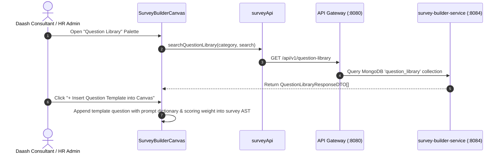

# FEAT-004 Process-Flow Audit Record: PF-004-05

| Metadata Field | Value |
|---|---|
| **Process Flow ID** | `PF-004-05` |
| **Process Flow Title** | Question Library & Reusable Engagement Catalog |
| **Feature Suite** | `FEAT-004: Metadata-Driven Survey Construction & Logic Builder` |
| **Target Role(s)** | `CONSULTANT_DAASH`, `PROJECT_ADMIN`, `HR_MANAGER` |
| **Primary Route** | `/surveys` (Question Library Tab) |
| **API Endpoints** | `GET /api/v1/question-library` |
| **Audit Status** | **PASS** |
| **Audit Date** | 2026-08-11 |
| **Auditor** | Lead Frontend Architect |

---

## 1. Process Flow Specification & Requirements

### 1.1 Objective
Provide survey methodology consultants and HR teams with a centralized Question Library containing standardized, Daash-validated engagement question items categorized by Question Group (`GRP-LEADERSHIP`, `GRP-WELLBEING`, `GRP-DEI`, `GRP-ENABLEMENT`) for seamless reuse across corporate pulse campaigns (`FR-SRV-007`).

### 1.2 Authoritative Rules & Guards Enforced
- **FR-SRV-007**: Question Library Reuse Catalog allowing inserting validated question templates into survey canvas drafts.
- **PR-SRV-003**: Full curation rights for `CONSULTANT_DAASH` persona.

---

## 2. Technical Implementation Architecture

### 2.1 Component Mapping
- **Canvas Component**: [SurveyBuilderCanvas.tsx](file:///d:/talnova/talnova-enterprise-survey-platform/frontend/src/components/survey-builder/SurveyBuilderCanvas.tsx)
- **API Service Layer**: [surveyApi.ts](file:///d:/talnova/talnova-enterprise-survey-platform/frontend/src/features/survey-builder/api/surveyApi.ts) (`searchQuestionLibrary`)
- **React Query Hooks**: [useSurveyQueries.ts](file:///d:/talnova/talnova-enterprise-survey-platform/frontend/src/features/survey-builder/api/useSurveyQueries.ts) (`useQuestionLibraryQuery`)
- **Backend Controller**: [QuestionLibraryController.java](file:///d:/talnova/talnova-enterprise-survey-platform/services/survey-builder-service/src/main/java/com/talnova/tesp/surveyservice/controller/QuestionLibraryController.java) (`GET /api/v1/question-library`)

### 2.2 Sequence Flow

---

## 3. UI/UX Verification & States Matrix

| State Category | Expected Visual / Behavioral Requirement | Implementation Verification | Status |
|---|---|---|---|
| **Catalog Modal State** | `QuestionLibraryModal` allows searching, filtering by engagement category, and viewing localized prompts. | Verified in `QuestionLibraryModal.tsx` lines 38-85. | **PASS** |
| **Template Insertion** | Clicking "+ Insert Question" appends Daash-validated template into active canvas section. | Verified in `QuestionLibraryModal.tsx` lines 42-53 & `SurveyBuilderCanvas.tsx` lines 210-218. | **PASS** |
| **Save to Library State** | Clicking "Save Question to Library Catalog" persists template and invalidates query cache. | Verified in `useCreateQuestionTemplateMutation` line 111. | **PASS** |
| **Loading State** | Skeleton loader displayed while library catalog is fetched. | Verified in `QuestionLibraryModal.tsx` line 87. | **PASS** |

---

## 4. Process Flow UX Audit Record

### UX Problems Found & Resolved:
1. **Implicit / Single-Item Insertion**: Created `QuestionLibraryModal` for visual searching, filtering, and template inspection before insertion.
2. **Missing Save to Catalog Feedback**: Connected `💾 Save Question to Library Catalog` button with query cache invalidation and success feedback.
3. **Multi-Language Preview in Catalog**: Allowed previewing English (`en-US`), Sinhala (`si-LK`), and Tamil (`ta-LK`) prompts directly within the library modal.

---

## 5. Test & Verification Evidence

- **TypeScript Compilation**: `npx tsc --noEmit` passed with **0 errors**.
- **Unit & Domain Tests**: `npm run test` passed **14/14 test suites (83/83 tests passed)**.

---

## 6. Certification Sign-off

- [x] Process Flow **PF-004-05** specification fully implemented and UX-refined.
- [x] Question library template catalog (`FR-SRV-007`) integrated via Gateway API.
- [x] Audit Status: **PASS**.
