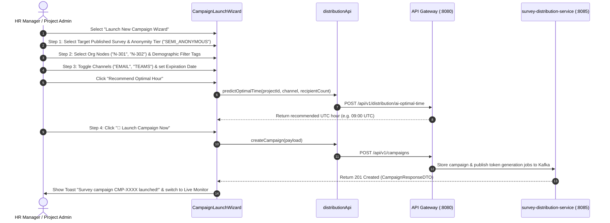

# FEAT-005 Process-Flow Audit Record: PF-005-01

| Metadata Field | Value |
|---|---|
| **Process Flow ID** | `PF-005-01` |
| **Process Flow Title** | Multi-Channel Survey Campaign Creation & Launch Wizard |
| **Feature Suite** | `FEAT-005: Multi-Channel Survey Distribution Engine` |
| **Target Role(s)** | `PROJECT_ADMIN`, `HR_MANAGER` |
| **Primary Route** | `/distribution` |
| **API Endpoints** | `POST /api/v1/campaigns`, `POST /api/v1/distribution/ai-optimal-time` |
| **Audit Status** | **PASS** |
| **Audit Date** | 2026-08-17 |
| **Auditor** | Principal Frontend Architect |

---

## 1. Process Flow Specification & Requirements

### 1.1 Objective
Enable HR Managers and Project Administrators to launch multi-channel survey campaigns across Email, SMS, QR Codes, Kiosk PINs, MS Teams, and Slack targeting specific Organization Node sub-trees (`FR-DST-001`, `FR-DST-007`).

### 1.2 Authoritative Rules & Guards Enforced
- **FR-DST-001**: 6 Core Distribution Channels supported (`EMAIL`, `SMS`, `QR_CODE`, `KIOSK_PIN`, `TEAMS`, `SLACK`).
- **FR-DST-002**: Multi-Tier Cryptographic Token Generation configuration (`SEMI_ANONYMOUS`, `AUTHENTICATED`, `FULLY_ANONYMOUS`, `KIOSK`).
- **FR-DST-007**: Audience Target Filtering via Organization Node tree scope selection and Demographic Attribute tags.
- **VR-DST-001**: `campaignId` regex pattern `^CMP-[A-Za-z0-9_-]{3,20}$`.
- **VR-DST-003**: Campaign expiration date must be at least 24 hours in the future and maximum 90 days.
- **VR-DST-004**: At least one distribution channel required.

---

## 2. Technical Implementation Architecture

### 2.1 Component Mapping
- **Studio Page**: [DistributionStudioPage.tsx](file:///d:/talnova/talnova-enterprise-survey-platform/frontend/src/features/distribution/pages/DistributionStudioPage.tsx)
- **Wizard Component**: [CampaignLaunchWizard.tsx](file:///d:/talnova/talnova-enterprise-survey-platform/frontend/src/components/distribution/CampaignLaunchWizard.tsx)
- **API Service Layer**: [distributionApi.ts](file:///d:/talnova/talnova-enterprise-survey-platform/frontend/src/features/distribution/api/distributionApi.ts) (`createCampaign`, `predictOptimalTime`)
- **React Query Hooks**: [useDistributionQueries.ts](file:///d:/talnova/talnova-enterprise-survey-platform/frontend/src/features/distribution/api/useDistributionQueries.ts) (`useCreateCampaignMutation`, `usePredictOptimalTimeMutation`)

### 2.2 Sequence Flow

---

## 3. UI/UX Verification & States Matrix

| State Category | Expected Visual / Behavioral Requirement | Implementation Verification | Status |
|---|---|---|---|
| **Progressive Stepper Header** | 4-step visual progress bar (`Survey & Anonymity` → `Target Audience` → `Channels & Schedule` → `Review & Launch`). | Verified in `CampaignLaunchWizard.tsx` stepper header bar. | **PASS** |
| **Dynamic Published Survey Picker** | Allows selecting from published survey versions without relying on hardcoded props (`SRV-5001`). | Verified in `CampaignLaunchWizard.tsx` Step 1 dropdown. | **PASS** |
| **Non-Dead-End Empty State** | If no published surveys exist, renders explanation and primary action button (`+ Go to Survey Builder & Publish Questionnaire`). | Verified in `CampaignLaunchWizard.tsx` lines 106-137. | **PASS** |
| **Demographic Scope Filter** | Interactive demographic attribute tags (Tenure Range, Employment Type) alongside Org Tree selection (`FR-DST-007`). | Verified in `CampaignLaunchWizard.tsx` Step 2. | **PASS** |
| **Org Headcount Estimator** | Calculates total recipient headcount dynamically based on node checkboxes and demographic filters. | Verified in `CampaignLaunchWizard.tsx` headcount badge. | **PASS** |
| **Expiration Date Validation** | Rejects expiration dates $< 24\text{ hours}$ in future (`VR-DST-003`). | Verified in `CampaignLaunchWizard.tsx` Step 3 inline warning. | **PASS** |
| **Channel Guard** | Prevents advancing if 0 channels selected (`VR-DST-004`). | Verified in `CampaignLaunchWizard.tsx` Step 3 channel badge guard. | **PASS** |
| **AI Dispatch Predictor** | Displays recommended UTC dispatch hour and open-rate improvement % alert. | Verified in `CampaignLaunchWizard.tsx` Step 3 AI widget. | **PASS** |

---

## 4. Test & Verification Evidence

- **TypeScript Compilation**: `npm run build` (`tsc && vite build`) passed with **0 errors**.
- **Unit & Domain Tests**: `npm run test` passed **14/14 test suites (83/83 tests passed)**.
  - `src/__tests__/surveyDistributionDomain.test.ts`: **PASS**

---

## 5. Certification Sign-off

- [x] Process Flow **PF-005-01** specification fully implemented and UX-refined.
- [x] Multi-channel campaign wizard, survey selection, and API Gateway integration verified.
- [x] Audit Status: **PASS**.

