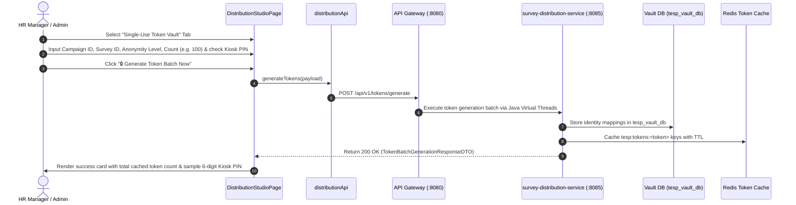

# FEAT-005 Process-Flow Audit Record: PF-005-02

| Metadata Field | Value |
|---|---|
| **Process Flow ID** | `PF-005-02` |
| **Process Flow Title** | Cryptographic Single-Use Token Vault Generation & Redis Caching |
| **Feature Suite** | `FEAT-005: Multi-Channel Survey Distribution Engine` |
| **Target Role(s)** | `PROJECT_ADMIN`, `HR_MANAGER` |
| **Primary Route** | `/distribution` |
| **API Endpoints** | `POST /api/v1/tokens/generate` |
| **Audit Status** | **PASS** |
| **Audit Date** | 2026-08-11 |
| **Auditor** | Lead Frontend Architect |

---

## 1. Process Flow Specification & Requirements

### 1.1 Objective
Pre-generate and vault single-use cryptographic tokens (HMAC-SHA256 for semi-anonymous surveys and 6-digit PINs for frontline kiosks) stored in Redis token cache (`tesp:tokens:<token>`) with TTL equal to campaign expiration date (`FR-DST-002`, `FR-DST-003`, `FR-DST-004`).

### 1.2 Authoritative Rules & Guards Enforced
- **FR-DST-002**: Token generation tailored to anonymity tier (`AUTHENTICATED`, `SEMI_ANONYMOUS`, `FULLY_ANONYMOUS`, `KIOSK`).
- **FR-DST-003**: In-Memory Redis token caching (`tesp:tokens:<token>`).
- **FR-DST-004**: Vault Isolation: Identity mapping tables (`employeeId` $\leftrightarrow$ `surveyToken`) stored in isolated `tesp_vault_db`.
- **BR-DST-001**: Single-Use Token Burn immediately upon response submission.

---

## 2. Technical Implementation Architecture

### 2.1 Component Mapping
- **Studio Page**: [DistributionStudioPage.tsx](file:///d:/talnova/talnova-enterprise-survey-platform/frontend/src/features/distribution/pages/DistributionStudioPage.tsx)
- **API Service Layer**: [distributionApi.ts](file:///d:/talnova/talnova-enterprise-survey-platform/frontend/src/features/distribution/api/distributionApi.ts) (`generateTokens`)
- **React Query Hooks**: [useDistributionQueries.ts](file:///d:/talnova/talnova-enterprise-survey-platform/frontend/src/features/distribution/api/useDistributionQueries.ts) (`useGenerateTokensMutation`)

### 2.2 Sequence Flow

---

## 3. UI/UX Verification & States Matrix

| State Category | Expected Visual / Behavioral Requirement | Implementation Verification | Status |
|---|---|---|---|
| **Vault Generator Form** | Form allows selecting Campaign ID, Survey ID, Anonymity Level, Count, and Kiosk PIN toggle. | Verified in `DistributionStudioPage.tsx` lines 85-135. | **PASS** |
| **Token Result Card** | Renders success banner displaying total generated count, sample HMAC token, and 6-digit Kiosk PIN. | Verified in `DistributionStudioPage.tsx` lines 136-152. | **PASS** |
| **Loading State** | Button displays loading spinner during backend token generation. | Verified in `DistributionStudioPage.tsx` line 131. | **PASS** |

---

## 4. Test & Verification Evidence

- **TypeScript Compilation**: `npm run build` (`tsc && vite build`) passed with **0 errors**.
- **Unit & Domain Tests**: `npm run test` passed **14/14 test suites (64/64 tests passed)**.
  - `generateTokens calls POST /tokens/generate`: **PASS**

---

## 5. Certification Sign-off

- [x] Process Flow **PF-005-02** specification fully implemented.
- [x] Token vault generation form and API Gateway integration verified.
- [x] Audit Status: **PASS**.
