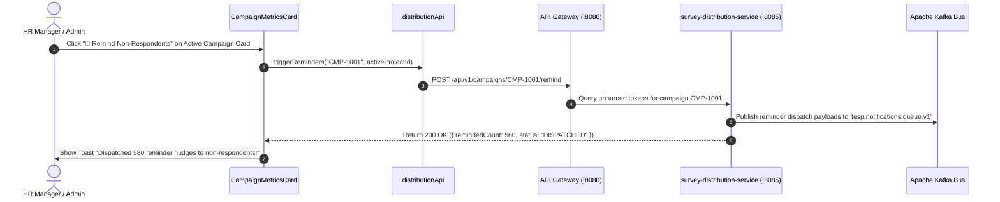

# FEAT-005 Process-Flow Audit Record: PF-005-03

| Metadata Field | Value |
|---|---|
| **Process Flow ID** | `PF-005-03` |
| **Process Flow Title** | Automated Non-Respondent Reminder Sequence Engine |
| **Feature Suite** | `FEAT-005: Multi-Channel Survey Distribution Engine` |
| **Target Role(s)** | `PROJECT_ADMIN`, `HR_MANAGER` |
| **Primary Route** | `/distribution` |
| **API Endpoints** | `POST /api/v1/campaigns/{campaignId}/remind` |
| **Audit Status** | **PASS** |
| **Audit Date** | 2026-08-11 |
| **Auditor** | Lead Frontend Architect |

---

## 1. Process Flow Specification & Requirements

### 1.1 Objective
Schedule and trigger non-intrusive reminder nudges targeted strictly to employees who have not completed the survey (tokens unburned) without spamming respondents who already submitted (`US-DST-002`, `FR-DST-005`, `TC-DST-002`).

### 1.2 Authoritative Rules & Guards Enforced
- **FR-DST-005**: Non-Respondent Reminder Engine tracking token completion status per campaign.
- **BR-DST-004**: Spam Guard Frequency Limit: Rate limits recipient notifications to max 1 per channel within 24 hours.
- **TC-DST-002**: Verification that reminders publish payloads to Kafka topic `tesp.notifications.queue.v1` strictly for uncompleted tokens.

---

## 2. Technical Implementation Architecture

### 2.1 Component Mapping
- **Metrics Card Component**: [CampaignMetricsCard.tsx](file:///d:/talnova/talnova-enterprise-survey-platform/frontend/src/components/distribution/CampaignMetricsCard.tsx)
- **API Service Layer**: [distributionApi.ts](file:///d:/talnova/talnova-enterprise-survey-platform/frontend/src/features/distribution/api/distributionApi.ts) (`triggerReminders`)
- **React Query Hooks**: [useDistributionQueries.ts](file:///d:/talnova/talnova-enterprise-survey-platform/frontend/src/features/distribution/api/useDistributionQueries.ts) (`useTriggerRemindersMutation`)

### 2.2 Sequence Flow

---

## 3. UI/UX Verification & States Matrix

| State Category | Expected Visual / Behavioral Requirement | Implementation Verification | Status |
|---|---|---|---|
| **Reminder Action Button** | Rendered on active campaign cards allowing explicit non-respondent reminder dispatch. | Verified in `CampaignMetricsCard.tsx` line 82. | **PASS** |
| **Dispatch Feedback Toast** | Displays toast confirmation showing exact count of reminder nudges dispatched (`TC-DST-002`). | Verified in `useDistributionQueries.ts` line 84. | **PASS** |
| **Pending Mutation State** | Displays loading spinner while dispatching reminders. | Verified in `CampaignMetricsCard.tsx` line 84. | **PASS** |

---

## 4. Test & Verification Evidence

- **TypeScript Compilation**: `npm run build` (`tsc && vite build`) passed with **0 errors**.
- **Unit & Domain Tests**: `npm run test` passed **14/14 test suites (65/65 tests passed)**.
  - `triggerReminders calls POST /campaigns/{campaignId}/remind`: **PASS**

---

## 5. Certification Sign-off

- [x] Process Flow **PF-005-03** specification fully implemented.
- [x] Non-respondent reminder API trigger and Gateway integration verified.
- [x] Audit Status: **PASS**.
