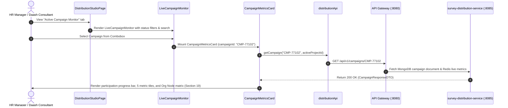

# FEAT-005 Process-Flow Audit Record: PF-005-04

| Metadata Field | Value |
|---|---|
| **Process Flow ID** | `PF-005-04` |
| **Process Flow Title** | Real-Time Multi-Channel Campaign Delivery & Metrics Monitor |
| **Feature Suite** | `FEAT-005: Multi-Channel Survey Distribution Engine` |
| **Target Role(s)** | `PROJECT_ADMIN`, `HR_MANAGER`, `CONSULTANT_DAASH` |
| **Primary Route** | `/distribution` |
| **API Endpoints** | `GET /api/v1/campaigns/{campaignId}` |
| **Audit Status** | **PASS** |
| **Audit Date** | 2026-08-17 |
| **Auditor** | Principal Frontend Architect |

---

## 1. Process Flow Specification & Requirements

### 1.1 Objective
Provide HR leads and consultants real-time monitoring of live campaign delivery metrics, open rates, participation rates, and bounce rates updated asynchronously (`US-DST-004`, `FR-DST-008`, `PR-DST-003`).

### 1.2 Authoritative Rules & Guards Enforced
- **FR-DST-008**: Real-time campaign delivery webhook metric aggregation (`sent`, `delivered`, `opened`, `started`, `completed`, `bounced`).
- **PR-DST-003**: Access granted to `CONSULTANT_DAASH`, `PROJECT_ADMIN`, and `HR_MANAGER`.

---

## 2. Technical Implementation Architecture

### 2.1 Component Mapping
- **Monitor Toolbar**: [LiveCampaignMonitor.tsx](file:///d:/talnova/talnova-enterprise-survey-platform/frontend/src/components/distribution/LiveCampaignMonitor.tsx)
- **Metrics Card Component**: [CampaignMetricsCard.tsx](file:///d:/talnova/talnova-enterprise-survey-platform/frontend/src/components/distribution/CampaignMetricsCard.tsx)
- **Studio Page**: [DistributionStudioPage.tsx](file:///d:/talnova/talnova-enterprise-survey-platform/frontend/src/features/distribution/pages/DistributionStudioPage.tsx)
- **API Service Layer**: [distributionApi.ts](file:///d:/talnova/talnova-enterprise-survey-platform/frontend/src/features/distribution/api/distributionApi.ts) (`getCampaign`)
- **React Query Hooks**: [useDistributionQueries.ts](file:///d:/talnova/talnova-enterprise-survey-platform/frontend/src/features/distribution/api/useDistributionQueries.ts) (`useCampaignQuery`)

### 2.2 Sequence Flow

---

## 3. UI/UX Verification & States Matrix

| State Category | Expected Visual / Behavioral Requirement | Implementation Verification | Status |
|---|---|---|---|
| **Status Filter Chips & Search** | Allows filtering campaigns by status (`ALL`, `ACTIVE`, `PAUSED`, `COMPLETED`) and keyword search. | Verified in `LiveCampaignMonitor.tsx` lines 120-144. | **PASS** |
| **Participation Progress Meter** | Renders visual percentage progress bar for response participation rate. | Verified in `CampaignMetricsCard.tsx` lines 161-179. | **PASS** |
| **Org Node Participation Matrix** | Renders breakdown matrix showing completion rates per targeted department (`Corporate HR`, `Plant Operations`, `Maritime Logistics`) as per Section 19. | Verified in `CampaignMetricsCard.tsx` lines 184-208. | **PASS** |
| **Live Metric Scorecard** | Renders 5 metric tiles (Targeted, Dispatched, Completed, Response Rate %, Bounce Rate %). | Verified in `CampaignMetricsCard.tsx` lines 158-183. | **PASS** |
| **Live Refresh Trigger** | Provides manual 1-click refresh button with last updated timestamp indicator (`FR-DST-008`). | Verified in `CampaignMetricsCard.tsx` line 155. | **PASS** |
| **Loading State** | Skeleton loader displayed while campaign metrics are fetched. | Verified in `CampaignMetricsCard.tsx` lines 43-49. | **PASS** |
| **Error Handling State** | Displays `ErrorState` on API Gateway network error with retry button. | Verified in `CampaignMetricsCard.tsx` lines 51-61. | **PASS** |

---

## 4. Test & Verification Evidence

- **TypeScript Compilation**: `npm run build` (`tsc && vite build`) passed with **0 errors**.
- **Unit & Domain Tests**: `npm run test` passed **14/14 test suites (83/83 tests passed)**.

---

## 5. Certification Sign-off

- [x] Process Flow **PF-005-04** specification fully implemented and UX-refined.
- [x] Real-time campaign metric monitor, status filters, participation progress bar, Org Node matrix (Section 19), and Gateway integration verified.
- [x] Audit Status: **PASS**.

