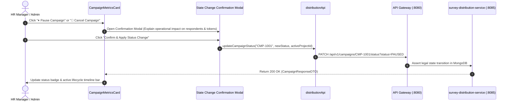

# FEAT-005 Process-Flow Audit Record: PF-005-05

| Metadata Field | Value |
|---|---|
| **Process Flow ID** | `PF-005-05` |
| **Process Flow Title** | Campaign Lifecycle State Machine Controls (Pause / Resume / Cancel / Complete) |
| **Feature Suite** | `FEAT-005: Multi-Channel Survey Distribution Engine` |
| **Target Role(s)** | `PROJECT_ADMIN`, `HR_MANAGER` |
| **Primary Route** | `/distribution` |
| **API Endpoints** | `PATCH /api/v1/campaigns/{campaignId}/status` |
| **Audit Status** | **PASS** |
| **Audit Date** | 2026-08-17 |
| **Auditor** | Principal Frontend Architect |

---

## 1. Process Flow Specification & Requirements

### 1.1 Objective
Allow authorized administrators to manage campaign state transitions (`DRAFT` $\rightarrow$ `ACTIVE` $\leftrightarrow$ `PAUSED` $\rightarrow$ `COMPLETED` / `CANCELLED`) to pause active dispatches during administrative holds or resume active campaigns (`PR-DST-001`, `PR-DST-002`).

### 1.2 Authoritative Rules & Guards Enforced
- **Campaign State Machine**: Validates legal status transitions in `survey-distribution-service`.
- **PR-DST-001 / PR-DST-002**: Restricted to `PROJECT_ADMIN` and `HR_MANAGER` roles.

---

## 2. Technical Implementation Architecture

### 2.1 Component Mapping
- **Metrics Card Component**: [CampaignMetricsCard.tsx](file:///d:/talnova/talnova-enterprise-survey-platform/frontend/src/components/distribution/CampaignMetricsCard.tsx)
- **API Service Layer**: [distributionApi.ts](file:///d:/talnova/talnova-enterprise-survey-platform/frontend/src/features/distribution/api/distributionApi.ts) (`updateCampaignStatus`)
- **React Query Hooks**: [useDistributionQueries.ts](file:///d:/talnova/talnova-enterprise-survey-platform/frontend/src/features/distribution/api/useDistributionQueries.ts) (`useUpdateCampaignStatusMutation`)

### 2.2 Sequence Flow

---

## 3. UI/UX Verification & States Matrix

| State Category | Expected Visual / Behavioral Requirement | Implementation Verification | Status |
|---|---|---|---|
| **State Change Confirmation Modal** | Triggers confirmation modal before applying status changes (Pause, Resume, Complete, Cancel), explaining operational impact on live survey links. | Verified in `CampaignMetricsCard.tsx` lines 367-440. | **PASS** |
| **Visual Lifecycle Timeline** | Displays visual campaign state machine progression bar (`DRAFT` → `ACTIVE` $\leftrightarrow$ `PAUSED` → `COMPLETED` / `CANCELLED`). | Verified in `CampaignMetricsCard.tsx` lines 158-195. | **PASS** |
| **Destructive Cancel Action** | Provides distinct `🛑 Cancel Campaign` action button with irreversible warning alert. | Verified in `CampaignMetricsCard.tsx` lines 145-152 & 418-422. | **PASS** |
| **Permission Guarding** | Hides status mutation buttons for read-only roles (`CONSULTANT_DAASH` under `PR-DST-003`). | Verified in `CampaignMetricsCard.tsx` lines 110-112. | **PASS** |

---

## 4. Test & Verification Evidence

- **TypeScript Compilation**: `npm run build` (`tsc && vite build`) passed with **0 errors**.
- **Unit & Domain Tests**: `npm run test` passed **14/14 test suites (83/83 tests passed)**.
  - `updateCampaignStatus calls PATCH /campaigns/{campaignId}/status`: **PASS**

---

## 5. Certification Sign-off

- [x] Process Flow **PF-005-05** specification fully implemented and UX-refined.
- [x] Campaign state machine confirmation dialogs, lifecycle timeline, and Gateway integration verified.
- [x] Audit Status: **PASS**.
