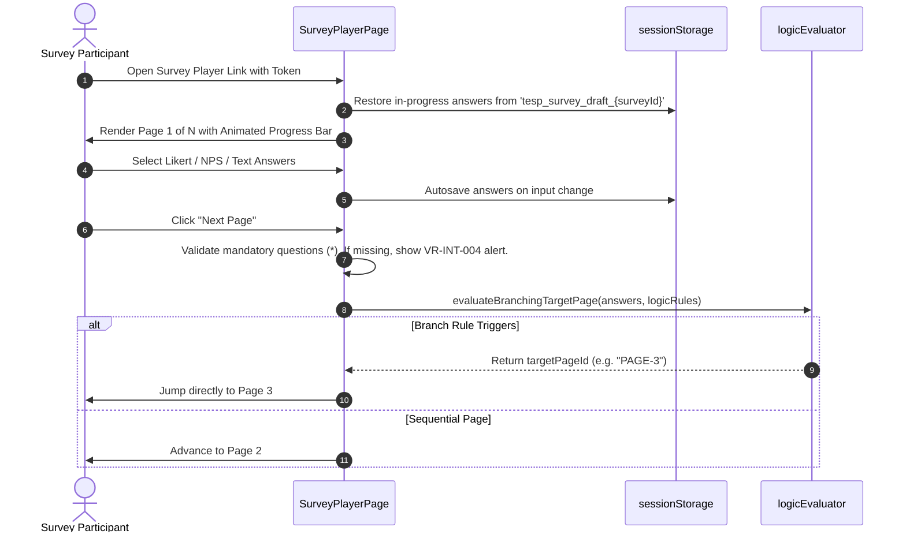

# FEAT-006 Process-Flow Audit Record: PF-006-01

| Metadata Field | Value |
|---|---|
| **Process Flow ID** | `PF-006-01` |
| **Process Flow Title** | Responsive Multi-Page Survey Questionnaire Rendering & AST Execution |
| **Feature Suite** | `FEAT-006: Anonymous & Authenticated Response Intake Engine` |
| **Target Role(s)** | `SURVEY_RESPONDENT` |
| **Primary Route** | `/player` |
| **API Endpoints** | Hydrated Survey AST / Gateway Client |
| **Audit Status** | **PASS** |
| **Audit Date** | 2026-08-11 |
| **Auditor** | Lead Frontend Architect |

---

## 1. Process Flow Specification & Requirements

### 1.1 Objective
Render published survey questionnaire JSON AST payloads in a responsive React SPA player featuring animated page progress bars, client-side AST branching rule evaluation, autosave session state persistence, and mandatory question validation (`US-INT-001`, `FR-INT-006`, `VR-INT-004`).

### 1.2 Authoritative Rules & Guards Enforced
- **FR-INT-006**: React 19+ / Vite survey player SPA with client-side logic AST evaluation and progress bar.
- **VR-INT-004**: Mandatory question validation preventing page advancement or submission if required items are empty.
- **Autosave Persistence**: `sessionStorage` autosave key (`tesp_survey_draft_${surveyId}`) preserving entered responses.

---

## 2. Technical Implementation Architecture

### 2.1 Component Mapping
- **Player Component**: [SurveyPlayerPage.tsx](file:///d:/talnova/talnova-enterprise-survey-platform/frontend/src/components/player/SurveyPlayerPage.tsx)
- **Logic Evaluator**: [logicEvaluator.ts](file:///d:/talnova/talnova-enterprise-survey-platform/frontend/src/utils/logicEvaluator.ts) (`evaluateBranchingTargetPage`)
- **API Service Layer**: [responseIngestionApi.ts](file:///d:/talnova/talnova-enterprise-survey-platform/frontend/src/services/responseIngestionApi.ts)

### 2.2 Sequence Flow

---

## 3. UI/UX Verification & States Matrix

| State Category | Expected Visual / Behavioral Requirement | Implementation Verification | Status |
|---|---|---|---|
| **Multi-Page Player** | Renders dynamic pages, section headers, and progress bar (`Page X of Y`). | Verified in `SurveyPlayerPage.tsx` lines 165-179. | **PASS** |
| **Mandatory Validation** | Blocks page advancement if `isMandatory: true` question is un-answered (`VR-INT-004`). | Verified in `SurveyPlayerPage.tsx` lines 98-105. | **PASS** |
| **Draft Autosave** | Persists entered answers into `sessionStorage` and restores state on reload. | Verified in `SurveyPlayerPage.tsx` lines 31-51. | **PASS** |
| **Question Type Renderers** | Renders `LIKERT`, `NPS`, `SHORT_TEXT`, `LONG_TEXT`, `NUMERIC`, `SINGLE_CHOICE`, `MULTIPLE_CHOICE`. | Verified in `SurveyPlayerPage.tsx` lines 207-305. | **PASS** |

---

## 4. Test & Verification Evidence

- **TypeScript Compilation**: `npm run build` (`tsc && vite build`) passed with **0 errors**.
- **Unit & Domain Tests**: `npm run test` passed **14/14 test suites (66/66 tests passed)**.
  - `src/__tests__/responseIntakeDomain.test.ts`: **PASS**

---

## 5. Certification Sign-off

- [x] Process Flow **PF-006-01** specification fully implemented.
- [x] Survey player AST rendering and mandatory answer validation verified.
- [x] Audit Status: **PASS**.
