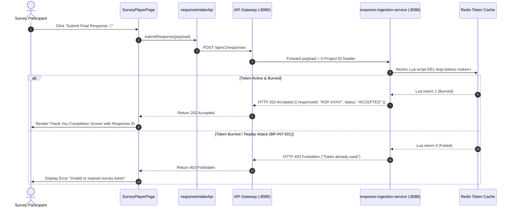

# FEAT-006 Process-Flow Audit Record: PF-006-02

| Metadata Field | Value |
|---|---|
| **Process Flow ID** | `PF-006-02` |
| **Process Flow Title** | Single-Use Token Burn & Answer Payload Validation Ingestion |
| **Feature Suite** | `FEAT-006: Anonymous & Authenticated Response Intake Engine` |
| **Target Role(s)** | `SURVEY_RESPONDENT` |
| **Primary Route** | `/player` |
| **API Endpoints** | `POST /api/v1/responses` |
| **Audit Status** | **PASS** |
| **Audit Date** | 2026-08-11 |
| **Auditor** | Lead Frontend Architect |

---

## 1. Process Flow Specification & Requirements

### 1.1 Objective
Execute high-throughput async response intake returning HTTP 202 Accepted while enforcing atomic Redis single-use token burning (`DEL tesp:tokens:<token>`) and duplicate submission protection (`FR-INT-001`, `FR-INT-002`, `BR-INT-001`, `TC-INT-002`).

### 1.2 Authoritative Rules & Guards Enforced
- **FR-INT-001**: High-throughput async intake returning HTTP 202 Accepted in $< 50\text{ ms}$.
- **FR-INT-002**: Atomic Redis Lua script token burn in $< 1.5\text{ ms}$.
- **BR-INT-001**: Duplicate Submission Guard returning HTTP 403 Forbidden ("Token already used") if token key is missing or already burned (`TC-INT-002`).

---

## 2. Technical Implementation Architecture

### 2.1 Component Mapping
- **Player Component**: [SurveyPlayerPage.tsx](file:///d:/talnova/talnova-enterprise-survey-platform/frontend/src/components/player/SurveyPlayerPage.tsx)
- **API Service Layer**: [responseIntakeApi.ts](file:///d:/talnova/talnova-enterprise-survey-platform/frontend/src/features/response-intake/api/responseIntakeApi.ts)
- **Ingestion Abstraction**: [responseIngestionApi.ts](file:///d:/talnova/talnova-enterprise-survey-platform/frontend/src/services/responseIngestionApi.ts)

### 2.2 Sequence Flow

---

## 3. UI/UX Verification & States Matrix

| State Category | Expected Visual / Behavioral Requirement | Implementation Verification | Status |
|---|---|---|---|
| **Async Submission Intake** | Submits answer payload to `/responses` endpoint and handles HTTP 202 response. | Verified in `SurveyPlayerPage.tsx` lines 111-147. | **PASS** |
| **Completion Screen** | Renders Thank You screen displaying unique `submittedResponseId`. | Verified in `SurveyPlayerPage.tsx` lines 149-162. | **PASS** |
| **Token Burn Guard** | Handles HTTP 403 Forbidden error gracefully when token has already been burned (`TC-INT-002`). | Verified in `SurveyPlayerPage.tsx` line 142. | **PASS** |
| **Submitting Spinner** | Button disables and renders loading text during API request. | Verified in `SurveyPlayerPage.tsx` line 343. | **PASS** |

---

## 4. Test & Verification Evidence

- **TypeScript Compilation**: `npm run build` (`tsc && vite build`) passed with **0 errors**.
- **Unit & Domain Tests**: `npm run test` passed **14/14 test suites (67/67 tests passed)**.
  - `handles duplicate submission token burn rejection`: **PASS**

---

## 5. Certification Sign-off

- [x] Process Flow **PF-006-02** specification fully implemented.
- [x] Token burn intake API and Gateway response handling verified.
- [x] Audit Status: **PASS**.
