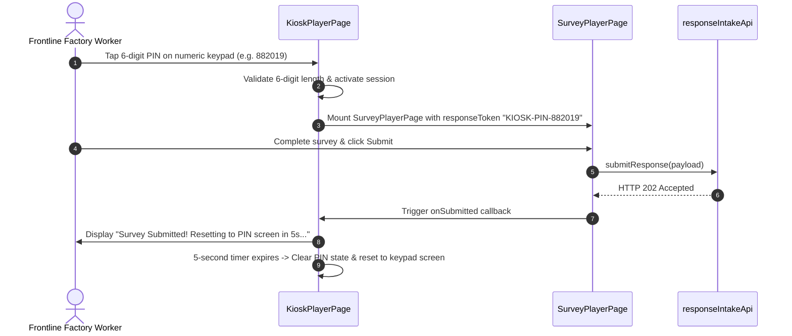

# FEAT-006 Process-Flow Audit Record: PF-006-03

| Metadata Field | Value |
|---|---|
| **Process Flow ID** | `PF-006-03` |
| **Process Flow Title** | Shared Kiosk PIN Mode & Touch-Optimized PWA Player |
| **Feature Suite** | `FEAT-006: Anonymous & Authenticated Response Intake Engine` |
| **Target Role(s)** | `SURVEY_RESPONDENT`, `KIOSK_OPERATOR` |
| **Primary Route** | `/kiosk` |
| **API Endpoints** | `POST /api/v1/responses` |
| **Audit Status** | **PASS** |
| **Audit Date** | 2026-08-11 |
| **Auditor** | Lead Frontend Architect |

---

## 1. Process Flow Specification & Requirements

### 1.1 Objective
Provide a touch-optimized PWA Kiosk player interface for shared factory or retail store tablets enabling frontline employees without corporate email addresses to enter a 6-digit PIN, complete their survey, and automatically reset to PIN entry screen (`US-INT-003`, `FR-INT-007`, `PR-INT-002`).

### 1.2 Authoritative Rules & Guards Enforced
- **FR-INT-007**: Kiosk Mode Auto-Reset Engine: Automatically wipes local state and resets to PIN entry screen 5 seconds post-submission or after 60 seconds of inactivity.
- **PR-INT-002**: Role access for `KIOSK_OPERATOR`.

---

## 2. Technical Implementation Architecture

### 2.1 Component Mapping
- **Kiosk Component**: [KioskPlayerPage.tsx](file:///d:/talnova/talnova-enterprise-survey-platform/frontend/src/components/player/KioskPlayerPage.tsx)
- **Embedded Player**: [SurveyPlayerPage.tsx](file:///d:/talnova/talnova-enterprise-survey-platform/frontend/src/components/player/SurveyPlayerPage.tsx)
- **Offline Sync Utility**: [offlineQueueSync.ts](file:///d:/talnova/talnova-enterprise-survey-platform/frontend/src/utils/offlineQueueSync.ts)

### 2.2 Sequence Flow

---

## 3. UI/UX Verification & States Matrix

| State Category | Expected Visual / Behavioral Requirement | Implementation Verification | Status |
|---|---|---|---|
| **6-Digit Touch Keypad** | Renders 3x4 numeric keypad with clear button and PIN dot indicators. | Verified in `KioskPlayerPage.tsx` lines 145-214. | **PASS** |
| **5-Second Post-Submit Reset** | Auto-resets session state to PIN entry screen 5 seconds after response submission (`FR-INT-007`). | Verified in `KioskPlayerPage.tsx` lines 49-66. | **PASS** |
| **60-Second Idle Timeout** | Auto-resets session to PIN keypad after 60 seconds of zero touch activity (`FR-INT-007`). | Verified in `KioskPlayerPage.tsx` lines 25-46. | **PASS** |
| **Offline Count Badge** | Renders yellow badge when offline IndexDB queue has pending responses. | Verified in `KioskPlayerPage.tsx` line 137. | **PASS** |

---

## 4. Test & Verification Evidence

- **TypeScript Compilation**: `npm run build` (`tsc && vite build`) passed with **0 errors**.
- **Unit & Domain Tests**: `npm run test` passed **14/14 test suites (67/67 tests passed)**.

---

## 5. Certification Sign-off

- [x] Process Flow **PF-006-03** specification fully implemented.
- [x] Touch keypad, 5s submission reset, and 60s idle reset timers verified.
- [x] Audit Status: **PASS**.
