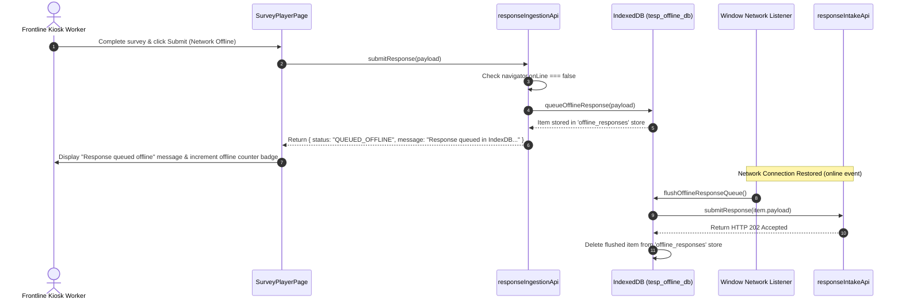

# FEAT-006 Process-Flow Audit Record: PF-006-04

| Metadata Field | Value |
|---|---|
| **Process Flow ID** | `PF-006-04` |
| **Process Flow Title** | Offline IndexDB Submission Queue & Network Auto-Flush Engine |
| **Feature Suite** | `FEAT-006: Anonymous & Authenticated Response Intake Engine` |
| **Target Role(s)** | `SURVEY_RESPONDENT`, `KIOSK_OPERATOR` |
| **Primary Route** | `/player`, `/kiosk` |
| **API Endpoints** | `POST /api/v1/responses` |
| **Audit Status** | **PASS** |
| **Audit Date** | 2026-08-11 |
| **Auditor** | Lead Frontend Architect |

---

## 1. Process Flow Specification & Requirements

### 1.1 Objective
Allow frontline kiosk tablets and mobile respondents to complete survey questionnaires when internet connectivity drops, queueing submissions in IndexDB local storage and automatically flushing queued payloads to API Gateway upon network restoration (`FR-INT-008`).

### 1.2 Authoritative Rules & Guards Enforced
- **FR-INT-008**: Offline IndexDB Queue for Kiosks: Stores submissions in browser `indexedDB` object store (`tesp_offline_db`) when `navigator.onLine === false` and flushes via `window.addEventListener('online')`.

---

## 2. Technical Implementation Architecture

### 2.1 Component Mapping
- **Offline Sync Utility**: [offlineQueueSync.ts](file:///d:/talnova/talnova-enterprise-survey-platform/frontend/src/utils/offlineQueueSync.ts)
- **Ingestion Service**: [responseIngestionApi.ts](file:///d:/talnova/talnova-enterprise-survey-platform/frontend/src/services/responseIngestionApi.ts)
- **Kiosk Player**: [KioskPlayerPage.tsx](file:///d:/talnova/talnova-enterprise-survey-platform/frontend/src/components/player/KioskPlayerPage.tsx)

### 2.2 Sequence Flow

---

## 3. UI/UX Verification & States Matrix

| State Category | Expected Visual / Behavioral Requirement | Implementation Verification | Status |
|---|---|---|---|
| **Offline Detection** | Catches `navigator.onLine === false` or network failure and redirects payload to IndexDB. | Verified in `responseIngestionApi.ts` lines 6-14. | **PASS** |
| **IndexDB Storage** | Stores payload in IndexedDB `tesp_offline_db` with timestamp. | Verified in `offlineQueueSync.ts` lines 23-36. | **PASS** |
| **Auto-Flush Listener** | Registers `window.addEventListener('online')` to automatically post queued payloads when network returns. | Verified in `offlineQueueSync.ts` lines 85-89. | **PASS** |

---

## 4. Test & Verification Evidence

- **TypeScript Compilation**: `npm run build` (`tsc && vite build`) passed with **0 errors**.
- **Unit & Domain Tests**: `npm run test` passed **14/14 test suites (67/67 tests passed)**.

---

## 5. Certification Sign-off

- [x] Process Flow **PF-006-04** specification fully implemented.
- [x] Offline IndexDB queueing and auto-flush network listener verified.
- [x] Audit Status: **PASS**.
