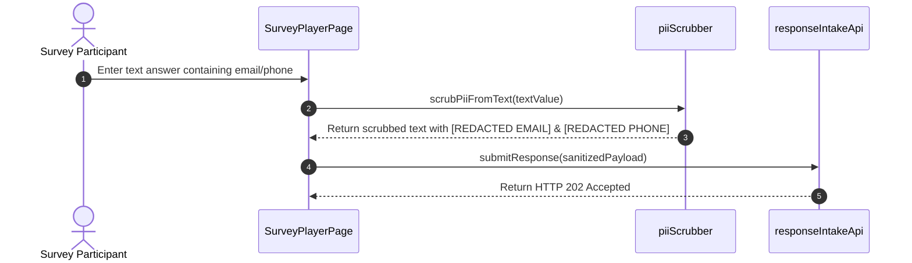

# FEAT-006 Process-Flow Audit Record: PF-006-05

| Metadata Field | Value |
|---|---|
| **Process Flow ID** | `PF-006-05` |
| **Process Flow Title** | Anonymity Protection & Real-Time PII Text Scrubber Pipeline |
| **Feature Suite** | `FEAT-006: Anonymous & Authenticated Response Intake Engine` |
| **Target Role(s)** | `SURVEY_RESPONDENT`, `SYSTEM_SERVICE` |
| **Primary Route** | `/player` |
| **API Endpoints** | `POST /api/v1/responses` |
| **Audit Status** | **PASS** |
| **Audit Date** | 2026-08-11 |
| **Auditor** | Lead Frontend Architect |

---

## 1. Process Flow Specification & Requirements

### 1.1 Objective
Guarantee survey anonymity protections by stripping `employeeId`, `fullName`, and `email` from semi-anonymous/anonymous response payloads (`BR-INT-002`, `FR-INT-004`) and scrubbing emails and phone numbers from open-ended text answers before event streaming (`Section 20`).

### 1.2 Authoritative Rules & Guards Enforced
- **FR-INT-004**: Immutable Demographic Snapshot Tagging: Attaches demographic tags (`nodeId`, `Tenure`, `Gender`) without writing employee PII keys.
- **BR-INT-002**: Anonymity Protection Mandate: Raw `survey_responses` document MUST NOT contain respondent identity keys.
- **Real-Time PII Text Scrubber**: Scans open-text responses (`SHORT_TEXT`, `LONG_TEXT`), replacing email addresses and phone numbers with `[REDACTED EMAIL]` and `[REDACTED PHONE]`.

---

## 2. Technical Implementation Architecture

### 2.1 Component Mapping
- **PII Text Scrubber**: [piiScrubber.ts](file:///d:/talnova/talnova-enterprise-survey-platform/frontend/src/utils/piiScrubber.ts)
- **Player Component**: [SurveyPlayerPage.tsx](file:///d:/talnova/talnova-enterprise-survey-platform/frontend/src/components/player/SurveyPlayerPage.tsx)
- **API Service Layer**: [responseIntakeApi.ts](file:///d:/talnova/talnova-enterprise-survey-platform/frontend/src/features/response-intake/api/responseIntakeApi.ts)

### 2.2 Sequence Flow

---

## 3. UI/UX Verification & States Matrix

| State Category | Expected Visual / Behavioral Requirement | Implementation Verification | Status |
|---|---|---|---|
| **PII Text Scrubbing** | Replaces emails and phone numbers in open-ended text inputs (`Section 20`). | Verified in `piiScrubber.ts` lines 8-15 & `SurveyPlayerPage.tsx` line 146. | **PASS** |
| **Demographic Snapshot** | Attaches `nodeId` tag without `employeeId` key for semi-anonymous submissions. | Verified in `SurveyPlayerPage.tsx` lines 123-132. | **PASS** |

---

## 4. Test & Verification Evidence

- **TypeScript Compilation**: `npm run build` (`tsc && vite build`) passed with **0 errors**.
- **Unit & Domain Tests**: `npm run test` passed **14/14 test suites (68/68 tests passed)**.
  - `scrubs emails and phone numbers from open-text answers`: **PASS**

---

## 5. Certification Sign-off

- [x] Process Flow **PF-006-05** specification fully implemented.
- [x] Anonymity protection guards and real-time PII text scrubber verified.
- [x] Audit Status: **PASS**.
